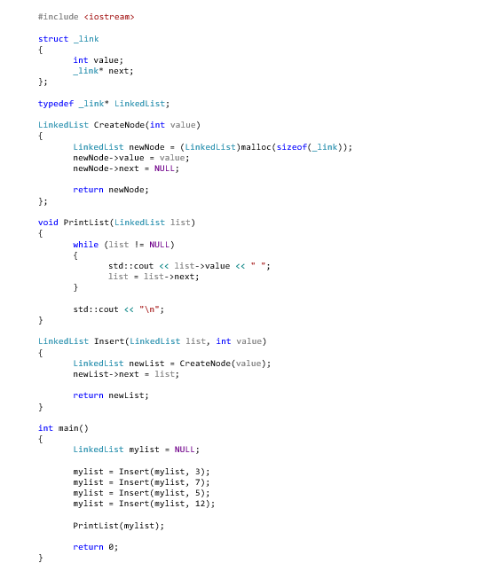

# C++ Version

This is probably the most "native" version of this programming test and the first one I wrote.  It may be evident from the first version of the code (LinkedList-Original.cpp), that this test originated in
C.  I didn't change it from there, because I thought it was a much better exercise to start with "really bad" code (well, completely non-object-oriented code), to see how well the candidate could read code
in a format that they weren't used to, as well as see how they approached the problem of "objectifying" the code.

The programming test starts with a piece of old code that is really just C, not C++:

<object data="https://github.com/aaron-enright/programming-tests/blob/master/LinkedLists/C-plus-plus/LinkedLists/LinkedList-Original/LinkedList-Original.cpp">
Your browser does not support the object tag!
</object>

We present this code either on a white-board or in a printout, then ask the following questions:

1. What is the output of the code?
2. Is is necessary to create a temp value in PrintList (that is, is it a bug as written)?  If not, why?

Answers:

1. 12 5 7 3
2. No.  This is bad style, but in C/C++, passing by value creates a temporary variable on the stack which can be used like any other variable, but is lost as soon as the stack frame is destroyed (just
like local variables).